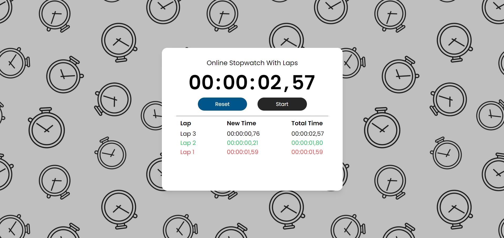

# Stopwatch Project

This repository contains the code for a **simple and functional stopwatch**, created as part of **TASK02** for the **Prodigy Infotech** internship. The stopwatch allows users to start, stop, and reset the timer, along with a lap counter to track multiple time intervals. It is designed with a focus on performance and simplicity.

## Features
- **Start/Stop functionality**: Start or pause the timer.
- **Reset button**: Reset the stopwatch back to zero.
- **Lap counter**: Track and display multiple intervals (laps).
- **Responsive Design**: Works on desktop and mobile screens.
  
## Technologies Used
- **HTML5**: For the basic structure of the page.
- **Tailwind CSS**: For styling and responsive layout.
- **JavaScript**: For implementing the stopwatch logic using **`setInterval`** for time tracking.

## Screenshots
**Stopwatch Interface**




## Installation

1. Clone this repository:
   ```bash
   git clone https://github.com/moncefchelm18/PRODIGY_WD_02.git
2. Navigate to the project directory:
   ```bash
cd stop-watch
3. Open the index.html file in your browser or use a local server to view the stopwatch.

## Demo
Check out the live version of this landing page [here](https://moncefchelm18.github.io/PRODIGY_WD_02/).

## Contact

If you have any questions or feedback, feel free to reach out via:

- **Email**: mounsif.chelgham@univ-constantine2.dz
- **Phone**: +213 562 189 015
- **LinkedIn**: [LinkedIn Profile](https://www.linkedin.com/in/mounsif-chelgham-b94202289/)

